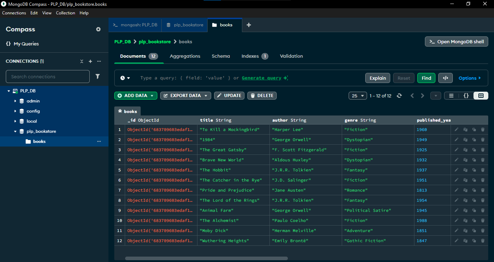

# PLP MongoDB Week 1 Assignment — Bookstore Project

This repository contains MongoDB scripts and data for the Week 1 assignment of the MERN Stack specialization at **Power Learn Project (PLP)**.

## 👨‍💻 Author

**Wayne Chibeu**  
MERN Specialization Student  
PLP Africa — 2025 Cohort  

---

## 🗂 Project Structure

| File | Description |
|------|-------------|
| `insert_books.js` | Inserts 12 sample books into the `plp_bookstore` database. |
| `aggregation.js`  | Contains aggregation pipeline queries (avg price, top author, etc.). |
| `indexing.js`     | Demonstrates creation of indexes and explains their performance impact. |
| `Week1-Assignment.md` | Instructions and checklist provided by the instructor. |
| `README.md`       | This file — contains overview, usage, and explanations. |

---

## 📚 Database: `plp_bookstore`

Each book has the following schema:

```js
{
  title: String,
  author: String,
  genre: String,
  published_year: Number,
  price: Number,
  in_stock: Boolean,
  pages: Number,
  publisher: String
}
```

---

## ✅ Completed Tasks

### 1. MongoDB Setup

- [x] Installed MongoDB locally
- [x] Created `plp_bookstore` DB and `books` collection
- [x] Inserted 12 sample documents via `insert_books.js`

### 2. CRUD Operations

- ✅ Performed `find`, `insertMany`, `updateOne`, `deleteOne` queries using `mongosh` and Compass

### 3. Advanced Queries

- ✅ Filtered books by `in_stock`, `published_year`
- ✅ Sorted by `price`
- ✅ Projected fields like `title`, `author`, `price`
- ✅ Used `limit()` and `skip()` for pagination

### 4. Aggregation Pipelines (`aggregation.js`)

- ✅ Calculated average price per genre
- ✅ Found most frequent author
- ✅ Grouped books by decade

### 5. Indexing (`indexing.js`)

- ✅ Created indexes on `title` and compound indexes on `author` + `published_year`
- ✅ Verified performance using `.explain("executionStats")` → saw `'stage': 'IXSCAN'` ✔️

---

## 🧪 Sample Queries (run in mongosh)

```js
// 1. Find all books by George Orwell
db.books.find({ author: "George Orwell" })

// 2. Books published after 1950 and in stock
db.books.find({ in_stock: true, published_year: { $gt: 1950 } })

// 3. Sort by price (ascending)
db.books.find().sort({ price: 1 })

// 4. Pagination - Page 1 (5 books)
db.books.find().limit(5).skip(0)

// 5. Average price per genre (aggregation)
db.books.aggregate([
  { $group: { _id: "$genre", avgPrice: { $avg: "$price" } } }
])
```

---

## 💡 Notes

- No external libraries were used.
- All scripts use native MongoDB driver and `mongosh`.
- Code is kept modular and readable for review.

---

## ✅ Screenshot

Below is a screenshot from MongoDB Compass showing the `books` collection and inserted sample data in the `plp_bookstore` database:



---

## 🏁 How to Run

1. Ensure MongoDB is running locally.
2. Run seeding script:
   ```bash
   node insert_books.js
   ```
3. Open `mongosh` or Compass to test your queries.
4. Run:
   ```bash
   node aggregation.js
   node indexing.js
   ```

---
